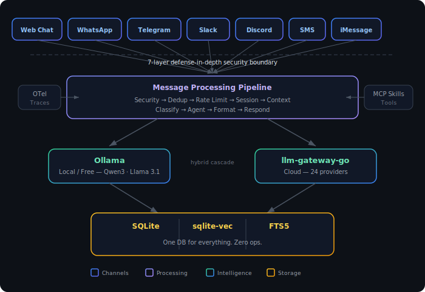

# SmartChannels

**Your AI assistant, every channel.**

A production-grade, self-hosted AI agent platform for multi-channel intelligent messaging. One assistant across Web Chat, WhatsApp, Telegram, Slack, Discord, SMS, and iMessage — with memory that persists, security that denies by default, and local-first intelligence that runs for free.

> Built from a clean slate. Designed for what comes next.

## Why SmartChannels?

| Problem | Others | SmartChannels |
|---------|--------|---------------|
| **Security** | Permissive defaults, 500+ CVEs | 7-layer defense-in-depth, deny-by-default |
| **Memory** | Session-only or none | 3-tier persistent memory across every channel |
| **Identity** | Per-channel silos | Cross-channel identity resolution |
| **Cost** | $300–750/mo cloud API bills | Local-first with Ollama — simple tasks run free |
| **Testing** | Untested LLM outputs | 5-layer test pyramid + red-team CI |
| **WhatsApp** | Unofficial Baileys — bans at scale | Official Meta Cloud API |
| **Operations** | Redis + Postgres + Qdrant | One SQLite file — zero external services |

## Features

- **7 channels** — Web Chat, WhatsApp, Telegram, Slack, Discord, SMS, iMessage
- **Persistent memory** — Three-tier (working → episodic → semantic) with sqlite-vec + FTS5 hybrid search
- **Deny-by-default security** — YAML allowlist permissions, hot-reloadable, every action audited
- **Local-first intelligence** — Ollama for free, cloud via llm-gateway-go when needed (hybrid cascade for 50–70% cost reduction)
- **MCP-native skills** — Every tool is an MCP server, universal standard
- **Cross-channel identity** — One user everywhere, talk on Slack, remember on WhatsApp
- **Observable from day one** — OpenTelemetry SDK 2.0 with gen_ai.* conventions
- **Proactive agent** — Monitor email, calendar, feeds — surface info before you ask
- **Tested like production** — Promptfoo red-teaming, mutation testing, property-based security tests
- **Zero ops** — SQLite for everything, PM2 + systemd, Litestream backup

## Tech Stack

| Area | Choice |
|------|--------|
| Runtime | Node 22 LTS |
| Framework | Hono + @hono/node-ws |
| Database | SQLite + Drizzle ORM |
| Vectors | sqlite-vec |
| Full-text search | FTS5 + Reciprocal Rank Fusion |
| LLM | Vercel AI SDK v6 behind adapter |
| Local LLM | Ollama (Qwen3, Llama 3.1) |
| Cloud LLM | llm-gateway-go (24+ providers) |
| Config | Zod v4 |
| Errors | neverthrow (Result types) |
| Observability | OTel SDK 2.0 + Pino 10 |
| Skills | MCP-native TypeScript |
| Circuit breakers | opossum |
| Testing | Vitest + Promptfoo + fast-check + Stryker |
| Process | PM2 + systemd |
| Backup | Litestream → S3/R2 |

## Architecture

  

## Status

**Under active development.** Early access coming Q3 2026.

Join the waitlist at [smartchannels.com](https://smartchannels.com).

## License

[MIT](LICENSE)
